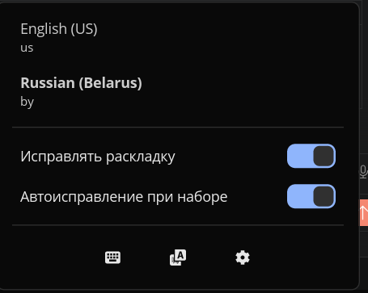
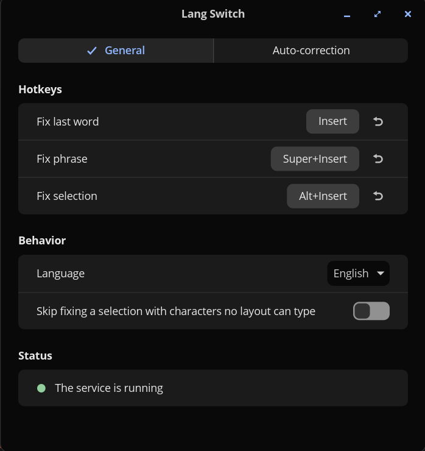
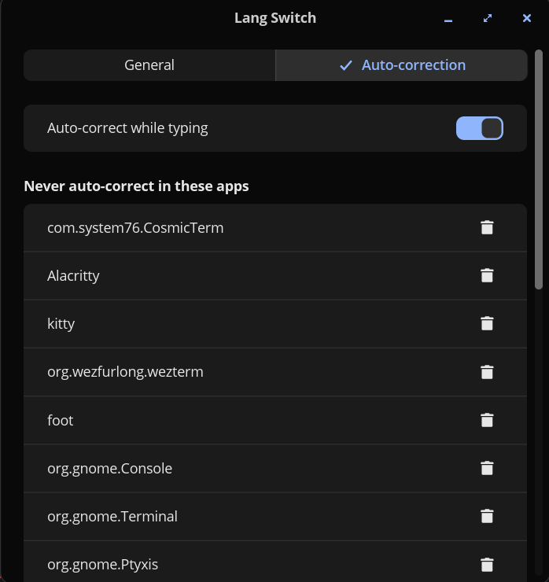

# Lang Switch for COSMIC

Typed `ghbdtn` instead of `привет`? Press **Insert** and the word is retyped in the right layout, and the layout is switched. A Punto Switcher–style layout fixer for the COSMIC™ desktop (Pop!_OS 24.04, Wayland).



## Features

- **Fix the last word** — `Insert`. Press again to undo.
- **Fix the phrase** typed since the last Enter — `Super+Insert`.
- **Fix the selected text** — `Alt+Insert`.
- **Auto-correction while typing** (off by default): a word clearly typed in the wrong layout is fixed when you press Space.
- Panel indicator of the current layout; click a layout in the popup to switch to it.
- Hotkeys are configurable; the hotkey is swallowed and never reaches the application.
- English and Russian interface.

Works with any two (or more) layouts from Settings → Keyboard; auto-correction knows English and Russian.

## Settings

Open them from the gear button in the popup, or run `cosmic-ext-lang-switch --settings`.





- **Hotkeys** — click a hotkey and press the new combination; ↶ restores the default.
- **Skip fixing a selection with characters no layout can type** — by default such characters (emoji) are dropped from a fixed selection; with this on, the selection is left alone.
- **Auto-correction** — excluded apps (terminals, code editors and password prompts by default) and words you asked it not to fix.
- **Status** — green when the background service works; red with the reason otherwise.

## Auto-correction

Turn on "Auto-correct while typing" in the popup. When you finish a word with Space and it was clearly typed in the wrong layout, it is retyped in the other one. Press `Insert` right after to undo: the word is then remembered and never auto-corrected again.

It leaves alone words shorter than 3 letters, words with digits or mixed case (`myVar`), words followed by punctuation, dictionary words (hunspell `en_US` / `ru_RU`), common technical words (`http`, `git`, `sudo`…), and anything typed in excluded apps. App exclusions work when the service is started by the applet: only the panel's connection is told which window is focused.

> **Passwords:** a password field can't be detected. A password of lowercase letters that reads like a word in the other layout may get auto-corrected. Keep auto-correction off if that matters to you, or exclude the app.

## Install

Lang Switch needs a small background service that reads the keyboard (`/dev/input`) and types corrections through a virtual keyboard (`/dev/uinput`). Wayland gives applications no other way to do this, so it is installed from source and can't be a Flatpak.

```sh
sudo apt install just pkg-config libxkbcommon-dev   # plus Rust from https://rustup.rs
git clone https://github.com/shagovAlexei/cosmic-ext-lang-switch
cd cosmic-ext-lang-switch
sudo usermod -aG input $USER                    # then log out and back in
just build-release && sudo just install
```

Then add **Lang Switch** in Settings → Desktop → Panel → Applets (log out and back in if it isn't listed yet). The applet starts the service itself.

Upgrading from a version with a systemd service: run `systemctl --user disable --now cosmic-ext-lang-switch` once.

Check that everything works:

```sh
cosmic-ext-lang-switch-daemon --check
```

Uninstall: remove the applet from the panel, then `sudo just uninstall`.

## Security

- The service sees every key you press. It keeps only the current word/phrase in memory and never writes keystrokes to disk or logs.
- On screen lock it forgets what was typed and suspends auto-correction until you are back.
- The installed udev rule lets the `input` group write to `/dev/uinput`, so any program of a user in that group can type keystrokes.
- The service grabs the keyboards and forwards every key except the hotkey. If it stops, the kernel releases the grab and the keyboard works directly again. With keyd, it grabs keyd's virtual keyboard instead.

## Troubleshooting

| Symptom | Fix |
|---|---|
| "Service is not running" | Logs: `journalctl --user \| grep lang-switch`. Remove and re-add the applet, or log in again |
| "No keyboard access" | Add yourself to `input` (see Install) and log out and back in |
| A selection isn't fixed in a terminal | Terminal text isn't editable; use `Insert` / `Super+Insert` there |

## Development

```sh
just verify       # fmt + clippy + tests
just run-daemon   # service in the foreground with logs
```

The auto-correction language models (`core/data/trigrams-*.bin`) are built from the hunspell dictionaries by `cargo run -p gen-model`; `cargo run --release -p gen-model -- --eval` reports detection and false-positive rates. Manual test matrix: [TESTING.md](TESTING.md).

## Author

Shagov Alexei ([@shagovAlexei](https://github.com/shagovAlexei))

## License

[GNU General Public License v3.0 only](LICENSE) (`GPL-3.0-only`).
